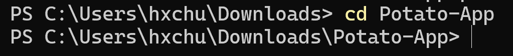
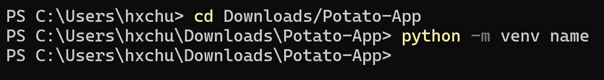
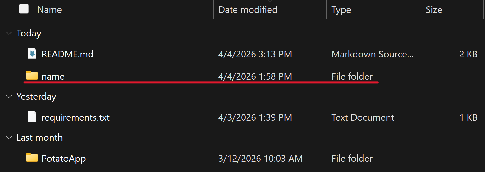
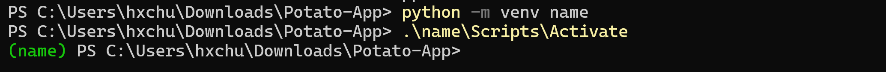
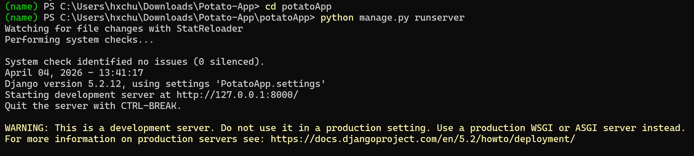
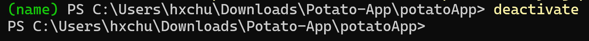

# Potato App
## How to run
1. Make sure that you have Python 3 installed, preferably at least Python 3.3. All Python 3.1x versions counts as greater than Python 3.3 and will work just as well. If not downloaded, go to https://www.python.org/downloads and select your preferred version.
2. Clone the repo
3. You will be using Python's venv. Open the terminal and move into the repo's root directory.

3. Type this into the terminal: ```python -m venv name```.
The ```name``` can be whatever you choose. You will reuse this venv whenever you run the app.


Location of the venv underlined in red.
4. Start the venv. If you are on Windows (either through command prompt or powershell), run ```.\name\Scripts\Activate```. If you are on macOS/Linux, run ```source name/bin/activate```.

5. If this is your first time running the app, run ```pip install -r requirements.txt```. This may take a while to run. Otherwise skip this step if already done previously.

6. To start the server, move into the potatoApp directory and run ```python manage.py runserver```.

7. Open up the url ```http://127.0.0.1:8000/app``` in your preferred browser. From here, you may use the app.
8. Once you are done using the app, press ```Ctrl + C``` to stop the server. Then run ```deactivate``` from the terminal to stop the venv.

